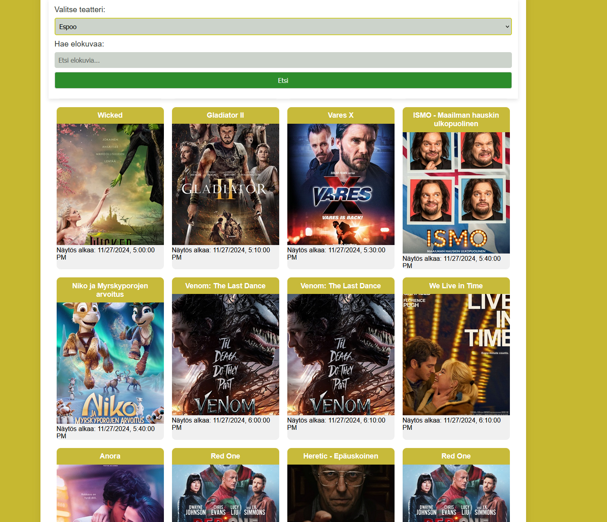

# Project Title 
Elokuvan hakukone, Paavo Koivistoinen

## Demo link:
Access my site at [Elokuva hakukone](https://elokuvahakukone.netlify.app)

## How was the workload divided
Tein itse 

## Table of Content:

- [About The App](#about-the-app)
- [Screenshots](#screenshots)
- [Technologies](#technologies)
- [Setup](#setup)
- [Approach](#approach)
- [Status](#status)
- [Credits](#credits)
- [License](#license)

## About The App
Elokuva hakukone on sovellus jolla voi hakea elokuvia jotka pyörivät teattereissa. Hakukoneella pystyy hakemaan alueittain tietoa elokuvista, kuten niiden aikatauluista elokuvissa. Elokuvia pystyy myös hakemaan muuten vain ilman aluetta tai ilman, että niillä olisi välitöntä esitystä tiedossa, joiden tiedot tulevat Open Movie tietokannasta.

## Screenshots

## Technologies
Käytin tässä HTML, CSS ja JavaScriptiä.

## Setup
Sovelluksen käyttö on yksinkertaista, täytyy vain avata linkki joka on upotettu demo kohtaan.
## Status
Sovellus on valmis ja julkaistu

## Credits
Käytin tehtävässä apunani ChatGPT tekoälyä auttamaan ratkaisemaan ongelmatilanteita ja kysyäkseni mielipiteitä ja ratkaisuja asioihin joita en aivan itse vielä ymmärtänyt.
